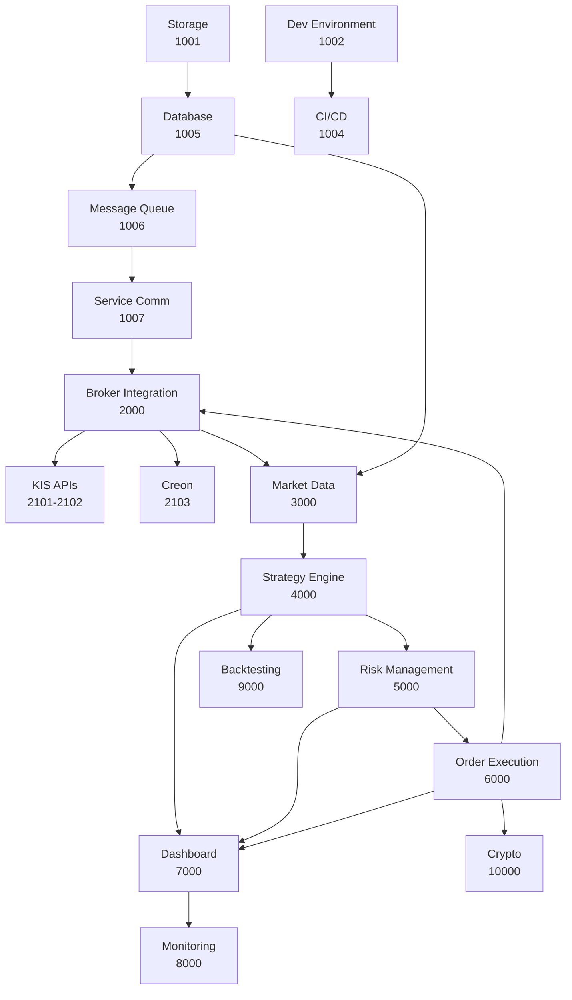

# JTS System Architecture & Module Mapping

## System Overview

The Joohan Trading System (JTS) is a comprehensive automated trading platform designed with a modular architecture. Each module is tracked through specifications (specs) that define features, tasks, and implementation details.

## Architecture Layers

### 1. Infrastructure Layer (1000-1999)
Foundation services and core platform capabilities.

```
┌─────────────────────────────────────────────────────────┐
│                  INFRASTRUCTURE LAYER                    │
├───────────────┬──────────────┬──────────────────────────┤
│   Storage     │  Development │      CI/CD Pipeline      │
│  [1001-1016]  │  [1021-1026] │      [1041-1051]         │
├───────────────┼──────────────┼──────────────────────────┤
│   Database    │ Message Queue│   Service Communication  │
│    [1005]     │    [1006]    │         [1007]           │
├───────────────┼──────────────┼──────────────────────────┤
│  Monitoring   │   Security   │    Testing Framework     │
│    [1008]     │    [1009]    │         [1010]           │
└───────────────┴──────────────┴──────────────────────────┘
```

### 2. Integration Layer (2000-2999)
External system integrations and broker connections.

```
┌─────────────────────────────────────────────────────────┐
│                   INTEGRATION LAYER                      │
├───────────────────────────────────────────────────────┤
│              Multi-Broker Integration [2000]            │
├──────────────┬──────────────┬──────────────────────────┤
│  KIS REST    │ KIS WebSocket│    Creon Windows COM     │
│   [2101]     │    [2102]    │         [2103]           │
├──────────────┼──────────────┼──────────────────────────┤
│Rate Limiting │Account Pool  │  Smart Order Routing     │
│   [2104]     │    [2105]    │         [2106]           │
├──────────────┼──────────────┼──────────────────────────┤
│  Service API │Error Handler │   Testing & Mocks        │
│   [2107]     │    [2108]    │         [2109]           │
└──────────────┴──────────────┴──────────────────────────┘
```

### 3. Data Layer (3000-3999)
Market data collection, processing, and storage.

```
┌─────────────────────────────────────────────────────────┐
│                      DATA LAYER                          │
├───────────────────────────────────────────────────────┤
│         Market Data Collection & Processing [3000]       │
├──────────────┬──────────────┬──────────────────────────┤
│  Real-time   │  Historical  │    Data Pipeline         │
│   Ingestion  │   Storage    │     Processing           │
├──────────────┼──────────────┼──────────────────────────┤
│   WebSocket  │   Database   │    Transformation        │
│   Handlers   │  Management  │      & Cleanup           │
└──────────────┴──────────────┴──────────────────────────┘
```

### 4. Business Logic Layer (4000-6999)
Core trading logic and portfolio management.

```
┌─────────────────────────────────────────────────────────┐
│                  BUSINESS LOGIC LAYER                    │
├───────────────┬──────────────┬──────────────────────────┤
│   Strategy    │     Risk     │      Execution           │
│  Engine [4000]│  Mgmt [5000] │   & Portfolio [6000]     │
├───────────────┼──────────────┼──────────────────────────┤
│  DSL Parser   │Position Limits│   Order Management      │
│  Strategy Dev │Exposure Control│   Portfolio Tracking    │
│  Backtesting  │Risk Metrics   │   Smart Execution       │
└───────────────┴──────────────┴──────────────────────────┘
```

### 5. Presentation Layer (7000-7999)
User interfaces and dashboards.

```
┌─────────────────────────────────────────────────────────┐
│                  PRESENTATION LAYER                      │
├───────────────────────────────────────────────────────┤
│            User Interface & Dashboard [7000]            │
├──────────────┬──────────────┬──────────────────────────┤
│  Web Dashboard│   Real-time  │    Admin Controls        │
│   Components  │   Updates    │    & Configuration       │
└──────────────┴──────────────┴──────────────────────────┘
```

### 6. Operations Layer (8000-12000)
Monitoring, testing, and deployment.

```
┌─────────────────────────────────────────────────────────┐
│                   OPERATIONS LAYER                       │
├───────────────┬──────────────┬──────────────────────────┤
│  Monitoring   │ Backtesting  │   Cryptocurrency         │
│   [8000]      │   [9000]     │      [10000]             │
├───────────────┼──────────────┼──────────────────────────┤
│ Performance   │              │    Deployment            │
│ Optimization  │              │    & DevOps              │
│   [11000]     │              │     [12000]              │
└───────────────┴──────────────┴──────────────────────────┘
```

## Module Specifications

### Infrastructure Modules

#### Storage Infrastructure (1001)
- **Purpose**: Manage tiered storage system
- **Components**:
  - Hot Storage (NVMe) - 1011 ✅
  - Database Mounts - 1012 ✅
  - Warm Storage (SATA) - 1013 ✅
  - Cold Storage (NAS) - 1014 ✅
  - Performance Optimization - 1015
  - Tiered Management - 1016
- **Status**: 66% Complete (4/6)

#### Development Environment (1002)
- **Purpose**: Standardize development setup
- **Components**:
  - Node.js & Yarn - 1021
  - VS Code Config - 1022
  - Docker Setup - 1023
  - Env & Secrets - 1024
  - Code Quality - 1025
  - Dev Scripts - 1026
- **Status**: Planning Phase

#### CI/CD Pipeline (1004)
- **Purpose**: Automated build and deployment
- **Components**:
  - GitHub Actions - 1041
  - Main Pipeline - 1042
  - Security Scans - 1043
  - Deployment - 1044
  - Docker Builds - 1045
  - Testing - 1046-1048
  - Release Mgmt - 1049
  - Quality Gates - 1050
  - Monitoring - 1051
- **Status**: Specification Complete

### Integration Modules

#### Multi-Broker Integration (2000)
- **Purpose**: Unified broker interface
- **Components**:
  - Unified Interface - 2100
  - KIS Integration - 2101-2102
  - Creon Integration - 2103
  - Rate Limiting - 2104
  - Account Management - 2105
  - Order Routing - 2106
  - Service Endpoints - 2107
  - Error Handling - 2108
  - Testing Framework - 2109
  - Monitoring - 2110
- **Status**: Planning Phase

### Data Modules

#### Market Data System (3000)
- **Purpose**: Real-time and historical data
- **Components**:
  - Data Collection
  - Stream Processing
  - Storage Management
  - API Endpoints
- **Status**: Not Started

### Business Logic Modules

#### Strategy Engine (4000)
- **Purpose**: Trading strategy development
- **Components**:
  - DSL Parser
  - Strategy Runtime
  - Indicator Library
  - Signal Generation
- **Status**: Not Started

#### Risk Management (5000)
- **Purpose**: Control trading risks
- **Components**:
  - Position Limits
  - Exposure Monitoring
  - Risk Metrics
  - Alert System
- **Status**: Not Started

#### Order Execution (6000)
- **Purpose**: Smart order management
- **Components**:
  - Order Router
  - Execution Algorithms
  - Portfolio Tracker
  - Performance Analytics
- **Status**: Not Started

## Module Dependencies

### Dependency Matrix



### Critical Path

1. **Foundation** (Must Complete First)
   - Storage Infrastructure (1001) ✅
   - Development Environment (1002) 🚧
   - Database Infrastructure (1005)

2. **Core Services** (Second Priority)
   - Message Queue (1006)
   - Service Communication (1007)
   - CI/CD Pipeline (1004)

3. **Integration** (Third Priority)
   - Multi-Broker Integration (2000)
   - Market Data Collection (3000)

4. **Business Logic** (Fourth Priority)
   - Strategy Engine (4000)
   - Risk Management (5000)
   - Order Execution (6000)

5. **User Interface** (Fifth Priority)
   - Dashboard (7000)
   - Monitoring (8000)

## Spec-to-Module Mapping

### Quick Reference Table

| Spec Range | Module | Domain | Priority |
|------------|--------|--------|----------|
| 1000-1010 | Infrastructure Setup | infrastructure | Critical |
| 1011-1016 | Storage System | infrastructure | High |
| 1021-1026 | Development Environment | infrastructure | High |
| 1041-1051 | CI/CD Pipeline | infrastructure | Medium |
| 2000-2110 | Broker Integration | broker | Critical |
| 3000-3XXX | Market Data | data | Critical |
| 4000-4XXX | Strategy Engine | strategy | High |
| 5000-5XXX | Risk Management | risk | Critical |
| 6000-6XXX | Order Execution | execution | Critical |
| 7000-7XXX | User Interface | ui | Medium |
| 8000-8XXX | Monitoring | monitoring | Medium |
| 9000-9XXX | Backtesting | testing | Low |
| 10000-10XXX | Cryptocurrency | crypto | Low |
| 11000-11XXX | Performance | optimization | Low |
| 12000-12XXX | Deployment | devops | Medium |

## Module Interaction Patterns

### Event-Driven Architecture

```
┌──────────────┐     Event      ┌──────────────┐
│   Producer   │──────────────>│  Event Bus   │
│   Module     │                │  (MsgQueue)  │
└──────────────┘                └──────┬───────┘
                                       │
                          ┌────────────┼────────────┐
                          ▼            ▼            ▼
                   ┌──────────┐ ┌──────────┐ ┌──────────┐
                   │Consumer 1│ │Consumer 2│ │Consumer 3│
                   └──────────┘ └──────────┘ └──────────┘
```

### Service Communication

1. **Synchronous (REST)**
   - UI → Backend Services
   - Service → Database
   - Admin Operations

2. **Asynchronous (Message Queue)**
   - Market Data → Strategy Engine
   - Strategy → Risk Management
   - Risk → Order Execution

3. **Real-time (WebSocket)**
   - Market Data Streams
   - UI Updates
   - Alert Notifications

## Module Status Tracking

### Completion Metrics

| Module | Specs | Completed | In Progress | Not Started | % Complete |
|--------|-------|-----------|-------------|-------------|------------|
| Storage | 6 | 4 | 0 | 2 | 66% |
| Dev Environment | 6 | 0 | 6 | 0 | 0% |
| CI/CD | 11 | 0 | 0 | 11 | 0% |
| Broker Integration | 11 | 0 | 0 | 11 | 0% |
| **Total Foundation** | 34 | 4 | 6 | 24 | 12% |

### Module Health Indicators

- 🟢 **Healthy**: Module functioning as expected
- 🟡 **Warning**: Minor issues or pending updates
- 🔴 **Critical**: Blocking issues or failures
- ⚫ **Not Started**: Module not yet implemented

### Current Module Status

| Module | Status | Health | Notes |
|--------|--------|--------|-------|
| Storage | Active | 🟢 | 4/6 tasks complete |
| Dev Environment | Planning | ⚫ | Starting implementation |
| CI/CD | Specified | ⚫ | Ready for implementation |
| Broker Integration | Planning | ⚫ | Architecture defined |
| Market Data | Not Started | ⚫ | Pending broker integration |
| Strategy Engine | Not Started | ⚫ | Awaiting data layer |
| Risk Management | Not Started | ⚫ | Design phase |
| Order Execution | Not Started | ⚫ | Requirements gathering |
| UI Dashboard | Not Started | ⚫ | Wireframes in progress |

## Implementation Roadmap

### Q1 2025 (Current)
- ✅ Storage Infrastructure
- 🚧 Development Environment
- 🚧 CI/CD Pipeline
- 📋 Broker Integration Planning

### Q2 2025
- Multi-Broker Integration
- Market Data Collection
- Basic Strategy Engine
- Initial UI Dashboard

### Q3 2025
- Risk Management System
- Order Execution Engine
- Advanced Strategy Features
- Production Monitoring

### Q4 2025
- Backtesting Framework
- Performance Optimization
- Cryptocurrency Support
- Full Production Deployment

## Architecture Principles

### Design Principles
1. **Modularity**: Each component is independently deployable
2. **Scalability**: Horizontal scaling for data and execution
3. **Reliability**: Fault tolerance and graceful degradation
4. **Security**: End-to-end encryption and access control
5. **Observability**: Comprehensive logging and monitoring

### Technology Stack
- **Backend**: Node.js, NestJS, TypeScript
- **Frontend**: Next.js, React, TypeScript
- **Database**: PostgreSQL (primary), SQLite (dev)
- **Message Queue**: RabbitMQ / Redis
- **Cache**: Redis
- **Monitoring**: Prometheus, Grafana
- **Container**: Docker, Kubernetes

## Conclusion

This architecture document provides a comprehensive view of the JTS system structure, module organization, and implementation roadmap. The modular design ensures scalability, maintainability, and allows for parallel development across different teams or phases.