---
# ============================================================================
# SPEC METADATA - This entire frontmatter section contains the spec metadata
# ============================================================================

# === IDENTIFICATION ===
id: "1001" # Numeric ID for stable reference
title: "Storage Infrastructure Coordination"
type: "feature" # prd | epic | feature | task | subtask | bug | spike

# === HIERARCHY ===
parent: "1000" # Parent spec ID
children: ["1011", "1012", "1013", "1014", "1015", "1016"] # Child spec IDs (if any)
epic: "1000" # Root epic ID for this work
domain: "infrastructure" # Business domain

# === WORKFLOW ===
status: "draft" # draft | reviewing | approved | in-progress | testing | done
priority: "high" # high | medium | low

# === TRACKING ===
created: "2025-08-24" # YYYY-MM-DD
updated: "2025-08-24" # YYYY-MM-DD
due_date: "" # YYYY-MM-DD (optional)
estimated_hours: 1 # Time estimate in hours (coordination only)
actual_hours: 0 # Time spent so far

# === DEPENDENCIES ===
dependencies: [] # Must be done before this (spec IDs)
blocks: ["1002", "1004", "1005"] # This blocks these specs (spec IDs)
related: ["1006", "1008"] # Related but not blocking (spec IDs)

# === IMPLEMENTATION ===
pull_requests: ["#18", "#19"] # GitHub PR numbers
commits: ["08e4cc5", "e5381ea"] # Key implementation commits
context_file: "context.md" # Implementation journal
files: [
    "/etc/fstab",
    "scripts/setup-lvm.sh",
    "scripts/storage-health.sh",
    "scripts/lvm-backup.sh",
    "scripts/nas-archival.sh",
    "scripts/tiered-storage.sh",
    "docs/STORAGE_SETUP.md",
  ] # Key files to modify

# === METADATA ===
tags: [
    "storage",
    "lvm",
    "ssd",
    "nas",
    "nfs",
    "tiered-storage",
    "filesystem",
    "performance",
    "ext4",
    "xfs",
  ] # Searchable tags
effort: "small" # small | medium | large | epic
risk: "low" # low | medium | high

# ============================================================================
---

# Storage Infrastructure Coordination

## Overview

Coordinate the implementation of a comprehensive three-tier storage infrastructure for the JTS trading system. This coordination feature manages the dependencies and implementation order of six specialized storage features that together provide optimal performance, capacity, and cost-effectiveness.

This feature serves as the central coordination point for:
- **Hot Storage (Task 1011)**: 4TB NVMe foundation with LVM
- **Database Integration (Task 1012)**: Service mount points and permissions
- **Warm Storage (Task 1013)**: 1TB SATA for backups and logs
- **Cold Storage (Task 1014)**: 28TB NAS for archival storage
- **Performance Optimization (Task 1015)**: Cross-tier performance tuning
- **Management Automation (Task 1016)**: Tiered storage lifecycle management

## Acceptance Criteria

- [ ] **Task Coordination**: All six child tasks (1011-1016) successfully completed in proper dependency order
- [ ] **Implementation Planning**: Detailed implementation plan with parallel execution strategy
- [ ] **Dependency Management**: Proper coordination of feature dependencies and blocking relationships
- [ ] **Integration Validation**: Cross-feature integration testing and validation
- [ ] **Documentation Coordination**: Unified documentation covering the complete storage infrastructure
- [ ] **Deployment Coordination**: Coordinated deployment strategy for all storage components
- [ ] **Testing Coordination**: End-to-end testing across all storage tiers and features
- [ ] **Operational Handoff**: Complete operational procedures for the integrated storage infrastructure

## Coordination Strategy

### Task Dependency Management

#### Mobile-Optimized Dependency Flow

```mermaid
flowchart TB
    %% Phase 1: Foundation
    subgraph P1 ["📋 Phase 1: Foundation (Sequential)"]
        A["🔥 Task 1011<br/>Hot Storage NVMe<br/>Directory Setup<br/><br/>⏱️ 2h | ⚠️ Low Risk"]
    end
    
    %% Phase 2: Parallel Implementation  
    subgraph P2 ["📋 Phase 2: Parallel Implementation"]
        D["🌡️ Task 1013<br/>Warm Storage SATA<br/>Setup<br/><br/>⏱️ 3h | ✅ Low Risk"]
        E["🧊 Task 1014<br/>Cold Storage NAS<br/>Integration<br/><br/>⏱️ 3h | ✅ Low Risk"]
    end
    
    %% Phase 3: Integration
    subgraph P3 ["📋 Phase 3: Integration (Sequential)"]
        B["🔌 Task 1012<br/>Database Mount<br/>Integration<br/><br/>⏱️ 4h | ⚠️ Medium Risk"]
        C["⚡ Task 1015<br/>Storage Performance<br/>Optimization<br/><br/>⏱️ 2h | ✅ Low Risk"]
    end
    
    %% Phase 4: Management
    subgraph P4 ["📋 Phase 4: Management (Final)"]
        F["🔄 Task 1016<br/>Tiered Storage<br/>Management<br/><br/>⏱️ 4h | ⚠️ Medium Risk"]
    end
    
    %% External Dependencies
    G["💾 Feature 1005<br/>Database Infrastructure<br/>(Unblocked by 1012)"]
    
    %% Dependencies
    A --> B
    A --> C
    D --> F
    E --> F
    B --> G
    
    %% Parallel indicators
    D -.-> E
    
    %% Styling for mobile readability
    classDef foundation fill:#ffcccc,stroke:#ff0000,stroke-width:2px
    classDef parallel fill:#ccffcc,stroke:#00aa00,stroke-width:2px
    classDef integration fill:#ffffcc,stroke:#ffaa00,stroke-width:2px
    classDef management fill:#e6ccff,stroke:#9900cc,stroke-width:2px
    classDef external fill:#ccccff,stroke:#0000aa,stroke-width:2px
    
    class A foundation
    class D,E parallel
    class B,C integration
    class F management
    class G external
```


**Implementation Phases:**

**Phase 1: Foundation (Sequential)**
- **Task 1011**: Hot Storage (NVMe) Directory Setup - Must complete first, blocks database integration
- **Duration**: 2 hours (reduced from 8h with directory approach)
- **Risk**: Low (reduced from high with LVM elimination)

**Phase 2: Parallel Implementation**
- **Task 1013**: Warm Storage (SATA) Setup - Independent, can run parallel with 1014
- **Task 1014**: Cold Storage (NAS) Integration - Independent, can run parallel with 1013
- **Duration**: 6 hours total (3h + 3h in parallel = 3h actual time)

**Phase 3: Integration (Sequential)**
- **Task 1012**: Database Mount Integration - Requires Task 1011
- **Task 1015**: Storage Performance Optimization - Requires Task 1011
- **Duration**: 6 hours total (4h + 2h sequential)

**Phase 4: Management (Final)**
- **Task 1016**: Tiered Storage Management - Requires Tasks 1013, 1014
- **Duration**: 4 hours

### Parallel Execution Strategy

#### Recommended Approach
Assign different team members or use isolated environments for parallel tasks to maximize efficiency while maintaining safety.

```bash
# Terminal 1: Warm Storage SATA Setup (Task 1013)
cd /home/joohan/dev/project-jts/jts
git checkout -b task/1013-warm-storage-sata
# Execute Task 1013 implementation

# Terminal 2: Cold Storage NAS Integration (Task 1014)  
cd /home/joohan/dev/project-jts/jts
git checkout -b task/1014-cold-storage-nas
# Execute Task 1014 implementation
```

#### Safety Measures for Parallel Execution
- **Task 1013** and **Task 1014** operate on completely different storage devices
- No shared filesystem operations or conflicting mount points
- Independent of directory-based infrastructure (no LVM dependencies)
- Each task can be safely rolled back without affecting the other

#### Cross-Task Integration Management

**Directory Structure Coordination**:
1. **Task 1011**: Creates base directory structure `/data/jts/hot/`
2. **Task 1012**: Creates service-specific directory permissions
3. **Task 1013**: Creates warm storage directories `/data/warm/`
4. **Task 1014**: Creates NAS directory structure `/mnt/synology/jts/`

**Configuration File Management**:
```bash
# Each task creates its own configuration sections
# Task 1011: Directory structure setup
# Task 1013: Warm storage mount configuration  
# Task 1014: NFS mount configuration
```

### Optimized Implementation Timeline

```
Week 1: Foundation (Reduced Complexity)
├── Task 1011 (2h) - Hot Storage Directory Setup
└── Testing and validation (1h)

Week 2: Parallel Implementation  
├── Task 1013 (3h) - Warm Storage SATA ──┐
├── Task 1014 (3h) - Cold Storage NAS ───┤ (Parallel = 3h total)
└── Testing both tasks (1h) ─────────────┘

Week 2-3: Integration (Can Start Earlier)
├── Task 1012 (4h) - Database Directory Integration  
├── Task 1015 (2h) - Performance Optimization
└── Integration testing (1h)

Week 3: Management
├── Task 1016 (4h) - Tiered Storage Management
└── End-to-end testing (1h)
```

**Total Time Reduction**: From 24+ hours to **15 hours** with directory approach
**Risk Reduction**: All tasks now Low-Medium risk (eliminated High risk from LVM)

### Risk Management Strategy

- **Low-Risk Operations**: All tasks use directory-based approach (no disk partitioning)
- **Independent Testing**: Each task can be tested in isolation with simple validation
- **Simple Rollback**: Directory removal instead of complex LVM rollback procedures  
- **Parallel Safety**: Tasks 1013/1014 operate on separate devices with zero data loss risk
- **Rapid Recovery**: Directory-based approach enables quick recreation if needed

## Technical Approach

### Tiered Storage Architecture

Design a comprehensive tiered storage architecture that provides optimal performance, massive capacity, and cost-effectiveness:

- **Hot Tier (NVMe)**: Ultra-fast access for real-time trading operations, active databases, and high-frequency data
- **Warm Tier (SATA)**: Local fast access for daily backups, logs, and medium-frequency data
- **Cold Tier (NAS)**: Massive capacity for historical data, long-term backups, and archival storage
- **Automated Tiering**: Intelligent data movement between tiers based on access patterns and age
- **Scalability**: Easy expansion at each tier when additional storage is needed
- **Performance**: Tier-optimized filesystems and mount options for each use case
- **Reliability**: Multi-tier backup strategy with LVM snapshots, daily backups, and NAS archival
- **Monitoring**: Cross-tier health checks and capacity monitoring for proactive maintenance

### Key Components

#### Tiered Storage Components

1. **Hot Storage - NVMe Setup**

   - 4TB NVMe SSD configured as LVM physical volume
   - Proper alignment for SSD optimization
   - TRIM support configuration for SSD longevity
   - Single volume group `vg_jts` with 4MB extent size
   - Reserved space for snapshots and future expansion

2. **Warm Storage - SATA Drive**

   - 1TB SATA drive for intermediate storage
   - Btrfs filesystem with compression for space efficiency
   - Dedicated mount point at `/data/warm-storage`
   - Automated rotation and cleanup policies

3. **Cold Storage - NAS Integration**

   - 28TB Synology NAS mounted via NFS at `/mnt/synology`
   - Organized directory structure for different data types
   - Network optimization for bulk data transfers
   - Automated archival and retrieval processes

4. **Multi-Tier Storage Layout**

   **Hot Storage - NVMe (4TB):**

   ```
   /data/jts/hot/ (4TB NVMe)
   ├── postgresql/          # PostgreSQL data (~800GB planned)
   │   ├── data/           # Database files
   │   ├── logs/           # Transaction logs
   │   └── config/         # Configuration files
   ├── clickhouse/         # ClickHouse data (~1.5TB planned)
   │   ├── data/           # Database files
   │   ├── logs/           # Query logs
   │   └── tmp/            # Temporary files
   ├── kafka/              # Kafka logs (~600GB planned)
   │   ├── data/           # Topic partitions
   │   └── logs/           # Service logs
   ├── mongodb/            # MongoDB collections (~200GB planned)
   │   ├── data/           # Database files
   │   ├── logs/           # Service logs
   │   └── config/         # Configuration files
   ├── redis/              # Redis persistence (~50GB planned)
   │   ├── data/           # RDB/AOF files
   │   └── logs/           # Service logs
   ├── docker/             # Docker volumes (~500GB planned)
   │   ├── volumes/        # Persistent volumes
   │   ├── containers/     # Container storage
   │   └── tmp/            # Temporary files
   └── backup/             # Local backup staging (~350GB planned)
       ├── daily/          # Daily snapshots
       ├── snapshots/      # Point-in-time backups
       └── staging/        # Backup preparation area
   ```

   **Warm Storage - SATA (1TB):**

   ```
   /dev/sda2 (931GB) - Formatted as btrfs with compression
   ├── daily-backups/          # Daily database snapshots
   ├── logs/                   # Application and system logs (30-day retention)
   └── temp-processing/        # Temporary large file operations
   ```

   **Cold Storage - NAS (28TB available):**

   ```
   /mnt/synology/jts/
   ├── archives/               # Long-term backups (3TB)
   ├── market-data/            # Historical market data (10TB)
   ├── backtesting/            # Backtesting datasets (2TB)
   ├── models/                 # ML models and training data (1TB)
   └── development/            # Development resources (1TB)
   ```

5. **Multi-Tier Filesystem Strategy**

   - **Hot Storage (ext4/XFS)**: PostgreSQL, ClickHouse, MongoDB, Redis with journal optimizations; XFS for Kafka
   - **Warm Storage (btrfs)**: Compression enabled for space efficiency, snapshot capabilities
   - **Cold Storage (NFS)**: Network filesystem with optimized transfer settings
   - **Cross-Tier Optimizations**: noatime, discard support, tier-appropriate alignment

6. **Data Lifecycle Management**

   - **Automated Aging**: Move data between tiers based on access patterns and retention policies
   - **ClickHouse Tiering**: Recent data (30 days) on NVMe, historical data on NAS
   - **PostgreSQL Archival**: Active transactions on NVMe, archived records on NAS
   - **Backup Lifecycle**: LVM snapshots → SATA dailies → NAS long-term archives

7. **Performance Optimization Per Tier**
   - **Hot Tier**: Maximum IOPS, minimal latency for trading operations
   - **Warm Tier**: Balanced performance for daily operations and backups
   - **Cold Tier**: Optimized for bulk transfers and long-term retention

### Child Task Overview

#### Task 1011: Hot Storage (NVMe) Directory Setup
- **Priority**: High (Foundation)
- **Risk**: Low (Directory creation only)
- **Duration**: 2 hours (reduced from 8h)
- **Scope**: Directory structure, permissions, service users
- **Blocks**: Tasks 1012, 1015

#### Task 1012: Database Mount Integration  
- **Priority**: High (Enables databases)
- **Risk**: Medium (Service integration)
- **Duration**: 4 hours
- **Scope**: Mount points, permissions, service users
- **Blocks**: Database services (1002, 1005)

#### Task 1013: Warm Storage (SATA) Setup
- **Priority**: Medium (Independent)
- **Risk**: Low (Secondary storage)
- **Duration**: 3 hours
- **Scope**: SATA drive, btrfs, compression, backup integration
- **Blocks**: Task 1016

#### Task 1014: Cold Storage (NAS) Integration
- **Priority**: Medium (Independent)
- **Risk**: Low (Network storage)
- **Duration**: 3 hours
- **Scope**: NFS optimization, directory structure, archival setup
- **Blocks**: Task 1016

#### Task 1015: Storage Performance Optimization
- **Priority**: Medium (Enhancement)
- **Risk**: Low (Reversible optimizations)
- **Duration**: 2 hours
- **Scope**: I/O schedulers, TRIM, performance tuning
- **Blocks**: None

#### Task 1016: Tiered Storage Management
- **Priority**: Low (Operational)
- **Risk**: Medium (Automation complexity)
- **Duration**: 4 hours
- **Scope**: Data lifecycle, automated tiering, health monitoring
- **Blocks**: None

### Implementation Coordination

This coordination feature manages:

1. **Implementation Planning and Sequencing**
   - Coordinate task implementation order based on dependencies
   - Manage parallel execution of independent tasks (1013, 1014)
   - Ensure proper integration testing between related tasks
   - Coordinate resource allocation and timing

2. **Cross-Task Integration Management**
   - Validate integration points between tasks
   - Coordinate testing across task boundaries  
   - Manage shared configuration files (/etc/fstab)
   - Ensure consistent naming and organization

3. **Documentation Coordination**
   - Unified documentation covering all storage tiers
   - Integration guides for cross-task dependencies
   - Operational procedures for the complete infrastructure
   - Troubleshooting guides covering all components

4. **Deployment Strategy Coordination**

   ```bash
   # Verify SSD device and capabilities
   lsblk -d -o name,size,model,tran,rota /dev/nvme0n1

   # Check TRIM/discard support
   lsblk -D /dev/nvme0n1

   # Verify no existing partitions
   fdisk -l /dev/nvme0n1

   # Check available space
   df -h
   ```

2. **Initialize LVM Infrastructure**

   ```bash
   # Install LVM tools if not present
   apt-get update && apt-get install -y lvm2

   # Create physical volume with optimal alignment
   pvcreate --dataalignment 4m /dev/nvme0n1

   # Create volume group with 4MB extent size
   vgcreate -s 4m vg_jts /dev/nvme0n1

   # Verify configuration
   pvdisplay /dev/nvme0n1
   vgdisplay vg_jts
   ```

3. **Create Logical Volumes**

   ```bash
   # Create logical volumes with optimized tiered sizing
   lvcreate -L 800G -n lv_postgres vg_jts
   lvcreate -L 1500G -n lv_clickhouse vg_jts
   lvcreate -L 600G -n lv_kafka vg_jts
   lvcreate -L 200G -n lv_mongodb vg_jts
   lvcreate -L 50G -n lv_redis vg_jts
   lvcreate -L 500G -n lv_docker vg_jts
   lvcreate -L 350G -n lv_local_backup vg_jts

   # Verify logical volume creation
   lvdisplay vg_jts
   lsblk | grep vg_jts
   ```

4. **Format Filesystems with Optimization**

   ```bash
   # PostgreSQL - ext4 with SSD optimizations
   mkfs.ext4 -F -E lazy_itable_init=0,lazy_journal_init=0,discard \
     -O ^has_journal,extent,flex_bg,sparse_super2 \
     /dev/vg_jts/lv_postgres

   # ClickHouse - ext4 with ordered journaling for consistency
   mkfs.ext4 -F -E lazy_itable_init=0,lazy_journal_init=0,discard \
     -O extent,flex_bg,sparse_super2 \
     /dev/vg_jts/lv_clickhouse

   # Kafka - XFS with optimized allocation groups
   mkfs.xfs -f -d agcount=32,su=64k,sw=1 \
     -l size=128m,su=64k \
     /dev/vg_jts/lv_kafka

   # MongoDB - ext4 with default journaling
   mkfs.ext4 -F -E lazy_itable_init=0,lazy_journal_init=0,discard \
     /dev/vg_jts/lv_mongodb

   # Redis - ext4 with writeback journaling for performance
   mkfs.ext4 -F -E lazy_itable_init=0,lazy_journal_init=0,discard \
     -O ^has_journal,extent,flex_bg \
     /dev/vg_jts/lv_redis

   # Local Backup - ext4 with standard configuration
   mkfs.ext4 -F -E lazy_itable_init=0,lazy_journal_init=0,discard \
     /dev/vg_jts/lv_local_backup

   # Docker - ext4 optimized for container workloads
   mkfs.ext4 -F -E lazy_itable_init=0,lazy_journal_init=0,discard \
     -O extent,flex_bg,sparse_super2 \
     /dev/vg_jts/lv_docker
   ```

#### Phase 2: Warm Storage (SATA) Setup

11. **SATA Drive Configuration**

    ```bash
    # Verify SATA drive
    lsblk -o NAME,SIZE,MODEL /dev/sda

    # Format SATA drive with btrfs for compression
    mkfs.btrfs -f -L "jts-warm-storage" /dev/sda2

    # Create mount point
    mkdir -p /data/warm-storage

    # Add to fstab with compression
    echo '/dev/sda2 /data/warm-storage btrfs defaults,compress=zstd:3,autodefrag,noatime 0 2' >> /etc/fstab

    # Mount and create directory structure
    mount /data/warm-storage
    mkdir -p /data/warm-storage/{daily-backups,logs,temp-processing}
    chmod 755 /data/warm-storage
    ```

#### Phase 3: Cold Storage (NAS) Setup

12. **NAS Directory Structure Setup**

    ```bash
    # Create comprehensive NAS directory structure
    sudo mkdir -p /mnt/synology/jts/{archives,market-data,backtesting,models,development}
    sudo mkdir -p /mnt/synology/jts/archives/{database,configs,strategies}
    sudo mkdir -p /mnt/synology/jts/market-data/{raw,processed,indicators}
    sudo mkdir -p /mnt/synology/jts/backtesting/{datasets,results,reports}
    sudo mkdir -p /mnt/synology/jts/models/{training,models,validation}
    sudo mkdir -p /mnt/synology/jts/development/{datasets,notebooks,experiments}

    # Set proper permissions
    sudo chown -R $USER:$USER /mnt/synology/jts/
    sudo chmod -R 755 /mnt/synology/jts/
    ```

13. **NFS Optimization**

    ```bash
    # Optimize NFS mount for better performance
    sudo umount /mnt/synology

    # Add optimized NFS mount to fstab
    sudo tee -a /etc/fstab << 'EOF'

    # JTS NAS - Optimized NFS mount for bulk data operations
    192.168.1.101:/volume1/cocodev /mnt/synology nfs rw,hard,intr,rsize=1048576,wsize=1048576,timeo=600,retrans=2,_netdev 0 0
    EOF

    # Remount with optimized settings
    sudo mount /mnt/synology

    # Verify optimized mount
    mount | grep synology
    ```

14. **Create Mount Points and Set Ownership**

    ```bash
    # Create mount directories for hot storage
    mkdir -p /var/lib/postgresql /var/lib/clickhouse /var/lib/kafka
    mkdir -p /var/lib/mongodb /var/lib/redis /var/lib/docker-jts /data/local-backup

    # Create service users if they don't exist
    useradd -r -s /bin/false -d /var/lib/postgresql postgres || true
    useradd -r -s /bin/false -d /var/lib/clickhouse clickhouse || true
    useradd -r -s /bin/false -d /var/lib/kafka kafka || true
    useradd -r -s /bin/false -d /var/lib/mongodb mongodb || true
    useradd -r -s /bin/false -d /var/lib/redis redis || true

    # Set proper ownership
    chown postgres:postgres /var/lib/postgresql
    chown clickhouse:clickhouse /var/lib/clickhouse
    chown kafka:kafka /var/lib/kafka
    chown mongodb:mongodb /var/lib/mongodb
    chown redis:redis /var/lib/redis
    chown root:docker /var/lib/docker-jts
    chown root:backup /data/local-backup

    # Set secure permissions
    chmod 750 /var/lib/postgresql /var/lib/clickhouse /var/lib/kafka
    chmod 750 /var/lib/mongodb /var/lib/redis /var/lib/docker-jts
    chmod 755 /data/local-backup
    ```

15. **Configure Optimized Mount Options**

    ```bash
    # Backup existing fstab
    cp /etc/fstab /etc/fstab.backup.$(date +%Y%m%d_%H%M%S)

    # Add optimized mount entries
    cat >> /etc/fstab << 'EOF'

    # JTS Trading System - High-Performance Storage Configuration
    # PostgreSQL - ext4 with writeback journaling for performance
    /dev/vg_jts/lv_postgres   /var/lib/postgresql  ext4  defaults,noatime,data=writeback,barrier=0,commit=30  0 2

    # ClickHouse - ext4 with ordered journaling for consistency
    /dev/vg_jts/lv_clickhouse /var/lib/clickhouse  ext4  defaults,noatime,data=ordered,commit=5              0 2

    # Kafka - XFS with optimized sequential I/O
    /dev/vg_jts/lv_kafka      /var/lib/kafka       xfs   defaults,noatime,nobarrier,logbufs=8,logbsize=256k,largeio,swalloc  0 2

    # MongoDB - ext4 with standard journaling
    /dev/vg_jts/lv_mongodb    /var/lib/mongodb     ext4  defaults,noatime,commit=10                          0 2

    # Redis - ext4 with writeback for memory-backed operations
    /dev/vg_jts/lv_redis      /var/lib/redis       ext4  defaults,noatime,data=writeback,barrier=0          0 2

    # Local Backup - ext4 with standard configuration
    /dev/vg_jts/lv_local_backup /data/local-backup  ext4  defaults,nodev,nosuid                              0 2

    # Docker - ext4 with container optimizations
    /dev/vg_jts/lv_docker     /var/lib/docker-jts  ext4  defaults,noatime                                   0 2
    EOF
    ```

16. **Mount All Filesystems**

    ```bash
    # Test mount configuration
    mount -a

    # Verify all mounts
    df -h | grep -E "(postgres|clickhouse|kafka|mongodb|redis|docker|backup)"

    # Check mount options for all tiers
    mount | grep -E "(vg_jts|warm-storage|synology)"
    ```

#### Phase 4: Tiered Storage Management Scripts

14. **Create Comprehensive Management Scripts**

    ```bash
    # scripts/setup-lvm.sh - Hot storage LVM setup script
    cat > scripts/setup-lvm.sh << 'EOF'
    #!/bin/bash
    set -euo pipefail

    DEVICE="/dev/nvme0n1"
    VG_NAME="vg_jts"

    echo "🚀 Starting JTS Storage Infrastructure Setup"

    # Validation checks
    if [[ ! -b "$DEVICE" ]]; then
        echo "❌ Device $DEVICE not found"
        exit 1
    fi

    # Create LVM structure
    echo "📦 Creating LVM structure on $DEVICE"
    pvcreate --dataalignment 4m "$DEVICE"
    vgcreate -s 4m "$VG_NAME" "$DEVICE"

    # Create logical volumes for tiered storage
    echo "💾 Creating logical volumes for hot storage tier"
    lvcreate -L 800G -n lv_postgres "$VG_NAME"
    lvcreate -L 1500G -n lv_clickhouse "$VG_NAME"
    lvcreate -L 600G -n lv_kafka "$VG_NAME"
    lvcreate -L 200G -n lv_mongodb "$VG_NAME"
    lvcreate -L 50G -n lv_redis "$VG_NAME"
    lvcreate -L 500G -n lv_docker "$VG_NAME"
    lvcreate -L 350G -n lv_local_backup "$VG_NAME"

    echo "✅ LVM setup completed successfully"
    EOF

    # scripts/storage-health.sh - Multi-tier storage monitoring script
    cat > scripts/storage-health.sh << 'EOF'
    #!/bin/bash

    echo "🔍 JTS Tiered Storage Health Check - $(date)"
    echo "================================================"

    # Check hot tier (NVMe) health
    echo "🔥 Hot Tier (NVMe) Status:"
    echo "Volume Group Status:"
    vgdisplay vg_jts | grep -E "(VG Name|VG Status|VG Size|Free)"

    echo -e "\nLogical Volume Usage:"
    df -h | grep -E "(Filesystem|vg_jts)" | column -t

    # Check warm tier (SATA) health
    echo -e "\n🌡️ Warm Tier (SATA) Status:"
    df -h /data/warm-storage | tail -1
    btrfs filesystem show /data/warm-storage 2>/dev/null || echo "Btrfs info unavailable"

    # Check cold tier (NAS) health
    echo -e "\n🧊 Cold Tier (NAS) Status:"
    df -h /mnt/synology | tail -1

    # Network connectivity test
    echo -e "\nNAS Connectivity Test:"
    ping -c 2 192.168.1.101 >/dev/null 2>&1 && echo "✅ NAS reachable" || echo "❌ NAS unreachable"

    # Alert on high usage across all tiers (>80%)
    echo -e "\n⚠️  Usage Alerts Across All Tiers:"

    # Hot tier alerts
    df -h | grep vg_jts | awk '{
        gsub(/%/, "", $5);
        if ($5 > 90) {
            print "CRITICAL: " $6 " (Hot) usage at " $5 "%"
        } else if ($5 > 80) {
            print "WARNING: " $6 " (Hot) usage at " $5 "%"
        }
    }'

    # Warm tier alerts
    df -h /data/warm-storage | tail -1 | awk '{
        gsub(/%/, "", $5);
        if ($5 > 90) {
            print "CRITICAL: " $6 " (Warm) usage at " $5 "%"
        } else if ($5 > 80) {
            print "WARNING: " $6 " (Warm) usage at " $5 "%"
        }
    }'

    # Cold tier alerts
    df -h /mnt/synology | tail -1 | awk '{
        gsub(/%/, "", $5);
        if ($5 > 90) {
            print "CRITICAL: " $6 " (Cold) usage at " $5 "%"
        } else if ($5 > 80) {
            print "WARNING: " $6 " (Cold) usage at " $5 "%"
        }
    }'

    # I/O performance across tiers
    echo -e "\n⚡ I/O Statistics:"
    echo "Hot Tier (NVMe):"
    iostat -x 1 1 2>/dev/null | grep nvme0n1 | tail -1 || echo "iostat not available"

    echo "Warm Tier (SATA):"
    iostat -x 1 1 2>/dev/null | grep sda | tail -1 || echo "iostat not available"

    # Check available space summary
    echo -e "\n📊 Storage Tier Summary:"
    echo "Hot Tier Available:  $(df -h | grep 'vg_jts.*/$' | awk '{print $4}' || echo 'N/A')"
    echo "Warm Tier Available: $(df -h /data/warm-storage | tail -1 | awk '{print $4}')"
    echo "Cold Tier Available: $(df -h /mnt/synology | tail -1 | awk '{print $4}')"
    EOF

    # scripts/lvm-backup.sh - LVM snapshot management
    cat > scripts/lvm-backup.sh << 'EOF'
    #!/bin/bash

    DATE=$(date +%Y%m%d_%H%M%S)
    VG_NAME="vg_jts"

    create_snapshots() {
        echo "📸 Creating LVM snapshots - $DATE"

        # Create snapshots for critical data
        lvcreate -L5G -s -n snap_postgres_$DATE /dev/$VG_NAME/lv_postgres
        lvcreate -L10G -s -n snap_clickhouse_$DATE /dev/$VG_NAME/lv_clickhouse
        lvcreate -L2G -s -n snap_mongodb_$DATE /dev/$VG_NAME/lv_mongodb

        echo "✅ Snapshots created successfully"
    }

    cleanup_old_snapshots() {
        echo "🧹 Cleaning up snapshots older than 7 days"

        # Find and remove old snapshots
        lvs --noheadings -o lv_name $VG_NAME | grep "^  snap_" | while read snapshot; do
            snapshot=$(echo $snapshot | xargs)  # trim whitespace
            creation_date=$(lvs --noheadings -o lv_time /dev/$VG_NAME/$snapshot | xargs)

            # Remove snapshots older than 7 days
            if [[ $(date -d "$creation_date" +%s) -lt $(date -d "7 days ago" +%s) ]]; then
                echo "Removing old snapshot: $snapshot"
                lvremove -f /dev/$VG_NAME/$snapshot
            fi
        done
    }

    case "${1:-create}" in
        create)
            create_snapshots
            ;;
        cleanup)
            cleanup_old_snapshots
            ;;
        *)
            echo "Usage: $0 {create|cleanup}"
            exit 1
            ;;
    esac
    EOF

    # scripts/nas-archival.sh - NAS archival management
    cat > scripts/nas-archival.sh << 'EOF'
    #!/bin/bash
    set -euo pipefail

    NAS_BASE="/mnt/synology/jts"
    DATE=$(date +%Y%m%d_%H%M%S)

    archive_clickhouse_data() {
        echo "📋 Archiving ClickHouse historical data to NAS"

        # Archive data older than 30 days
        ARCHIVE_DATE=$(date -d '30 days ago' +%Y-%m-%d)

        # Create archive directory structure
        mkdir -p "$NAS_BASE/market-data/raw/$ARCHIVE_DATE"

        # Move old partitions to NAS (example - adjust for actual ClickHouse setup)
        # clickhouse-client --query="ALTER TABLE market_data MOVE PARTITION '$ARCHIVE_DATE' TO DISK 'nas_disk'"

        echo "✅ ClickHouse archival completed for date: $ARCHIVE_DATE"
    }

    archive_postgresql_data() {
        echo "📋 Archiving PostgreSQL old data to NAS"

        # Create PostgreSQL archive directory
        mkdir -p "$NAS_BASE/archives/database/postgresql/$DATE"

        # Export old transaction data (customize based on schema)
        pg_dump -h localhost -U postgres --table='old_transactions' trading_db > \
            "$NAS_BASE/archives/database/postgresql/$DATE/old_transactions.sql"

        echo "✅ PostgreSQL archival completed"
    }

    sync_development_data() {
        echo "📋 Syncing development resources to NAS"

        # Sync Jupyter notebooks
        rsync -av --delete /home/joohan/notebooks/ "$NAS_BASE/development/notebooks/"

        # Sync development datasets
        rsync -av --delete /home/joohan/dev/datasets/ "$NAS_BASE/development/datasets/"

        echo "✅ Development sync completed"
    }

    backup_configurations() {
        echo "📋 Backing up system configurations to NAS"

        mkdir -p "$NAS_BASE/archives/configs/$DATE"

        # Backup important configs
        cp -r /etc/fstab "$NAS_BASE/archives/configs/$DATE/"
        cp -r /home/joohan/dev/project-jts/jts/configs/ "$NAS_BASE/archives/configs/$DATE/"

        echo "✅ Configuration backup completed"
    }

    case "${1:-all}" in
        clickhouse)
            archive_clickhouse_data
            ;;
        postgresql)
            archive_postgresql_data
            ;;
        development)
            sync_development_data
            ;;
        configs)
            backup_configurations
            ;;
        all)
            archive_clickhouse_data
            archive_postgresql_data
            sync_development_data
            backup_configurations
            ;;
        *)
            echo "Usage: $0 {clickhouse|postgresql|development|configs|all}"
            exit 1
            ;;
    esac
    EOF

    # scripts/tiered-storage.sh - Automated tiered storage management
    cat > scripts/tiered-storage.sh << 'EOF'
    #!/bin/bash
    set -euo pipefail

    HOT_TIER="/var/lib"
    WARM_TIER="/data/warm-storage"
    COLD_TIER="/mnt/synology/jts"

    check_tier_usage() {
        echo "📊 Checking storage tier usage"

        # Check hot tier usage
        echo "Hot Tier (NVMe) Usage:"
        df -h | grep vg_jts | awk '{print $6 ": " $5 " used (" $4 " free)"}'

        # Check warm tier usage
        echo "\nWarm Tier (SATA) Usage:"
        df -h /data/warm-storage | tail -1 | awk '{print $6 ": " $5 " used (" $4 " free)"}'

        # Check cold tier usage
        echo "\nCold Tier (NAS) Usage:"
        df -h /mnt/synology | tail -1 | awk '{print $6 ": " $5 " used (" $4 " free)"}'
    }

    migrate_logs_to_warm() {
        echo "📎 Moving old logs to warm storage"

        # Move logs older than 7 days to warm tier
        find /var/log -name "*.log" -mtime +7 -exec mv {} "$WARM_TIER/logs/" \;

        # Compress moved logs
        find "$WARM_TIER/logs/" -name "*.log" -exec gzip {} \;

        echo "✅ Log migration to warm tier completed"
    }

    migrate_backups_to_cold() {
        echo "📎 Moving old backups to cold storage"

        # Move backups older than 30 days to cold tier
        find "$WARM_TIER/daily-backups/" -mtime +30 -exec mv {} "$COLD_TIER/archives/" \;

        echo "✅ Backup migration to cold tier completed"
    }

    cleanup_temp_files() {
        echo "🧤 Cleaning up temporary files"

        # Clean up temp processing files older than 3 days
        find "$WARM_TIER/temp-processing/" -mtime +3 -delete

        # Clean up Docker temp files
        docker system prune -f --volumes

        echo "✅ Temporary file cleanup completed"
    }

    optimize_storage() {
        echo "⚙️ Optimizing storage across tiers"

        # Defragment btrfs on warm tier
        btrfs filesystem defragment -r "$WARM_TIER"

        # TRIM NVMe drives
        fstrim -av | grep nvme

        echo "✅ Storage optimization completed"
    }

    case "${1:-check}" in
        check)
            check_tier_usage
            ;;
        migrate)
            migrate_logs_to_warm
            migrate_backups_to_cold
            ;;
        cleanup)
            cleanup_temp_files
            ;;
        optimize)
            optimize_storage
            ;;
        all)
            check_tier_usage
            migrate_logs_to_warm
            migrate_backups_to_cold
            cleanup_temp_files
            optimize_storage
            ;;
        *)
            echo "Usage: $0 {check|migrate|cleanup|optimize|all}"
            exit 1
            ;;
    esac
    EOF

    # Make all scripts executable
    chmod +x scripts/setup-lvm.sh scripts/storage-health.sh scripts/lvm-backup.sh
    chmod +x scripts/nas-archival.sh scripts/tiered-storage.sh
    ```

15. **Configure Multi-Tier System Optimizations**

```bash
# Configure SSD I/O scheduler
echo 'ACTION=="add|change", KERNEL=="nvme0n1", ATTR{queue/scheduler}="none"' > /etc/udev/rules.d/60-ssd-scheduler.rules

# Enable TRIM support
echo 'ACTION=="add|change", KERNEL=="nvme0n1", ATTR{queue/discard_max_bytes}!="0", RUN+="/sbin/fstrim -v /"' >> /etc/udev/rules.d/60-ssd-scheduler.rules

# Configure automatic TRIM for all NVMe mounts
cat > /etc/systemd/system/fstrim-all.service << 'EOF'
[Unit]
Description=Discard unused filesystem blocks on all NVMe filesystems

[Service]
Type=oneshot
ExecStart=/bin/bash -c 'for mount in /var/lib/postgresql /var/lib/clickhouse /var/lib/kafka /var/lib/mongodb /var/lib/redis /var/lib/docker-jts /data/local-backup; do /sbin/fstrim -v "$mount"; done'
EOF

cat > /etc/systemd/system/fstrim-all.timer << 'EOF'
[Unit]
Description=Run fstrim weekly

[Timer]
OnCalendar=weekly
Persistent=true

[Install]
WantedBy=timers.target
EOF

# Enable TRIM timer
systemctl enable fstrim-all.timer
systemctl start fstrim-all.timer

# Configure NFS client optimizations
echo 'net.core.rmem_default = 262144' >> /etc/sysctl.conf
echo 'net.core.rmem_max = 16777216' >> /etc/sysctl.conf
echo 'net.core.wmem_default = 262144' >> /etc/sysctl.conf
echo 'net.core.wmem_max = 16777216' >> /etc/sysctl.conf
sysctl -p

# Set up automated tiered storage management
cat > /etc/systemd/system/tiered-storage.service << 'EOF'
[Unit]
Description=JTS Tiered Storage Management
After=network.target

[Service]
Type=oneshot
ExecStart=/home/joohan/dev/project-jts/jts/scripts/tiered-storage.sh all
User=root
EOF

cat > /etc/systemd/system/tiered-storage.timer << 'EOF'
[Unit]
Description=Run tiered storage management daily

[Timer]
OnCalendar=daily
Persistent=true

[Install]
WantedBy=timers.target
EOF

# Enable tiered storage management
systemctl enable tiered-storage.timer
systemctl start tiered-storage.timer
```

16. **Multi-Tier Performance Validation and Testing**

    ```bash
    # scripts/performance-test.sh
    cat > scripts/performance-test.sh << 'EOF'
    #!/bin/bash

    echo "🚀 JTS Storage Performance Testing"
    echo "=================================="

    test_sequential_write() {
        local mount_point=$1
        local test_file="$mount_point/perf_test_seq_write"

        echo "Testing sequential write on $mount_point"
        dd if=/dev/zero of="$test_file" bs=1M count=1000 oflag=direct 2>&1 | tail -1
        rm -f "$test_file"
    }

    test_random_iops() {
        local mount_point=$1
        local test_file="$mount_point/perf_test_random"

        echo "Testing random IOPS on $mount_point"
        fio --name=random_test --ioengine=libaio --iodepth=32 --rw=randread --bs=4k \
            --direct=1 --size=500M --numjobs=1 --runtime=30 --group_reporting \
            --filename="$test_file" | grep -E "(read|IOPS)"
        rm -f "$test_file"
    }

    test_network_throughput() {
        local nas_path="/mnt/synology/jts/development/test"
        echo "Testing NAS network throughput"

        # Test write throughput
        dd if=/dev/zero of="$nas_path/network_test" bs=1M count=1000 2>&1 | tail -1

        # Test read throughput
        dd if="$nas_path/network_test" of=/dev/null bs=1M 2>&1 | tail -1
        rm -f "$nas_path/network_test"
    }

    # Test each storage tier
    echo "🔥 Testing Hot Tier (NVMe)"
    for mount in /var/lib/postgresql /var/lib/clickhouse /var/lib/kafka; do
        echo -e "\n📊 Testing $mount"
        test_sequential_write "$mount"
        test_random_iops "$mount"
    done

    echo -e "\n🌡️ Testing Warm Tier (SATA)"
    test_sequential_write "/data/warm-storage"

    echo -e "\n🧊 Testing Cold Tier (NAS)"
    test_network_throughput
    EOF

    chmod +x scripts/performance-test.sh
    ```

## Performance Optimization Considerations

### Hot Tier (NVMe) Optimizations

- **I/O Scheduler**: Set to `none` for NVMe drives to minimize CPU overhead
- **TRIM Support**: Weekly automated TRIM operations to maintain SSD performance
- **Mount Options**: `noatime` to reduce metadata writes, optimized commit intervals
- **LVM Configuration**: 4MB extent size for large volume efficiency
- **Filesystem Tuning**: Database-specific optimizations (ext4 vs XFS)

### Warm Tier (SATA) Optimizations

- **Compression**: Btrfs with zstd:3 compression for space efficiency
- **Autodefrag**: Automatic defragmentation for sustained performance
- **Write Caching**: Optimized for sequential write workloads (backups, logs)
- **Snapshot Support**: Btrfs snapshots for point-in-time recovery

### Cold Tier (NAS) Optimizations

- **Network Buffers**: Increased read/write buffer sizes (1MB) for bulk transfers
- **NFS Version**: NFSv3 with TCP for reliable large file operations
- **Connection Parameters**: Optimized timeout and retry settings
- **Batch Operations**: Minimize network round-trips through batching
- **Parallel Transfers**: Multiple streams for large dataset synchronization

### Cross-Tier Data Flow Optimization

- **Async Operations**: Background data movement between tiers
- **Compression**: On-the-fly compression for NAS transfers
- **Deduplication**: Prevent duplicate data across tiers
- **Intelligent Caching**: Frequently accessed cold data cached on warm tier

## Dependencies

This feature forms part of the foundation infrastructure and has dependencies on:

- **Network Infrastructure**: Stable NFS connectivity to Synology NAS
- **System Prerequisites**: LVM2, btrfs-progs, NFS client packages
- **Storage Hardware**: Confirmed availability of NVMe and SATA drives

Should be implemented early in the infrastructure setup process before database services are deployed.

## Implementation Validation and Testing

### Per-Task Validation Procedures

#### Task 1011 Validation (Directory Structure)
```bash
# Verify directory structure creation
ls -la /data/jts/hot/
tree /data/jts/hot/ || ls -la /data/jts/hot/*/

# Test service user permissions
sudo -u postgres touch /data/jts/hot/postgresql/test_write
sudo -u clickhouse touch /data/jts/hot/clickhouse/test_write
sudo -u kafka touch /data/jts/hot/kafka/test_write
sudo -u mongodb touch /data/jts/hot/mongodb/test_write
sudo -u redis touch /data/jts/hot/redis/test_write

# Verify directory space monitoring
/usr/local/bin/jts-storage-monitor.sh

# Performance verification
time dd if=/dev/zero of=/data/jts/hot/postgresql/perf_test bs=1M count=1000
rm /data/jts/hot/postgresql/perf_test
```

#### Task 1012 Validation (Database Integration)
```bash
# Verify service user directory access
ls -la /data/jts/hot/{postgresql,clickhouse,kafka,mongodb,redis}/
df -h / | grep -E "Filesystem|/$"

# Test database service directory permissions
sudo -u postgres mkdir /data/jts/hot/postgresql/test_db
sudo -u clickhouse mkdir /data/jts/hot/clickhouse/test_ch
sudo -u kafka mkdir /data/jts/hot/kafka/test_kafka

# Cleanup test directories
sudo rm -rf /data/jts/hot/*/test_*
```

#### Tasks 1013 & 1014 Validation (Warm/Cold Storage)
```bash
# SATA storage verification
df -h /data/warm/
ls -la /data/warm/{daily-backups,logs,temp-processing}/

# NAS connectivity and performance
df -h /mnt/synology/jts/
time dd if=/dev/zero of=/mnt/synology/jts/development/network_test bs=1M count=100
rm /mnt/synology/jts/development/network_test

# Directory structure verification
ls -la /mnt/synology/jts/{archives,market-data,backtesting,models,development}/
```

### Integration Testing Procedures

#### Cross-Task Dependency Validation
```bash
# Verify all storage tiers are accessible
df -h | grep -E "(/$|warm|synology)"

# Test tiered data flow simulation
echo "test data" > /data/jts/hot/backup/hot_test
cp /data/jts/hot/backup/hot_test /data/warm/temp-processing/warm_test  
cp /data/warm/temp-processing/warm_test /mnt/synology/jts/development/cold_test

# Verify file integrity across tiers
sha256sum /data/jts/hot/backup/hot_test /data/warm/temp-processing/warm_test /mnt/synology/jts/development/cold_test

# Cleanup test files
rm -f /data/jts/hot/backup/hot_test /data/warm/temp-processing/warm_test /mnt/synology/jts/development/cold_test
```

#### Performance Integration Testing
```bash
# Monitor storage performance across tiers
iostat -x 1 5 | grep -E "(nvme|sda)" || echo "iostat not available"

# Check available space summary across all tiers
echo "=== Storage Tier Summary ==="
echo "Hot Tier Available:  $(df -h / | tail -1 | awk '{print $4}')"
echo "Warm Tier Available: $(df -h /data/warm 2>/dev/null | tail -1 | awk '{print $4}' || echo 'N/A')"
echo "Cold Tier Available: $(df -h /mnt/synology 2>/dev/null | tail -1 | awk '{print $4}' || echo 'N/A')"
```

### Comprehensive Testing Strategy

#### Hot Tier (Directory-Based) Testing
- **Directory Structure Validation**: Verify all service directories created with correct permissions
- **Permission Testing**: Validate service user access to respective directories
- **Performance Benchmarking**: Run I/O performance tests to validate NVMe performance
- **Space Monitoring**: Test directory-based space tracking and alerting

#### Warm Tier (SATA) Testing  
- **Mount Point Testing**: Confirm SATA filesystem mounts correctly
- **Directory Organization**: Verify backup, logs, and temp-processing directories
- **Backup Performance**: Validate sequential write performance for backup operations

#### Cold Tier (NAS) Testing
- **NFS Connectivity**: Test NFS mount stability and performance
- **Network Performance**: Benchmark large file transfer speeds to/from NAS
- **Directory Structure**: Verify comprehensive directory organization
- **Concurrent Access**: Test multiple simultaneous NFS operations

#### Cross-Tier Integration Testing
- **Data Flow Validation**: Test data movement simulation between all tiers
- **Monitoring Integration**: Validate comprehensive monitoring across all storage tiers
- **Performance Validation**: Ensure tier interactions maintain optimal performance
- **Recovery Procedures**: Test rollback and recovery for each tier independently

## Claude Code Instructions

```
When implementing this storage infrastructure:

CRITICAL SAFETY MEASURES:
1. BACKUP ALL EXISTING DATA before starting any disk operations
2. Verify the correct device path (/dev/nvme0n1) before running any commands
3. Test all commands on a non-production system first
4. Create comprehensive rollback procedures

IMPLEMENTATION STEPS:
1. Validate SSD device and check for existing partitions/data
2. Create LVM structure with proper alignment (--dataalignment 4m)
3. Use exact filesystem creation commands with optimization flags
4. Set up mount points with correct ownership and permissions
5. Configure /etc/fstab with performance-optimized mount options
6. Create and test all management scripts (setup, health check, backup)
7. Implement SSD-specific optimizations (I/O scheduler, TRIM support)
8. Set up automated monitoring and maintenance (systemd timers)
9. Run comprehensive performance validation tests
10. Document all procedures and create troubleshooting guide

PERFORMANCE CONSIDERATIONS:
- Use noatime mount option to reduce write operations
- Configure appropriate commit intervals for ext4 filesystems
- Set up XFS with optimal allocation group count for Kafka
- Enable SSD-specific optimizations (TRIM, I/O scheduler)
- Monitor I/O patterns and adjust configurations as needed

ERROR HANDLING:
- Include comprehensive error checking in all scripts
- Validate each step before proceeding to the next
- Provide clear error messages and recovery instructions
- Create rollback procedures for each major step
```

## Notes

### Critical Safety Considerations

- **CRITICAL**: This is a high-risk operation involving disk partitioning and filesystem creation
- **BACKUP**: Complete system backup is mandatory before implementation
- **TESTING**: All procedures must be tested on non-production systems first
- **NETWORK DEPENDENCY**: NAS availability is critical for cold tier operations
- **DATA INTEGRITY**: Cross-tier data movement must maintain consistency

### Performance Considerations

- **TIERED PERFORMANCE**: Each tier optimized for its specific access patterns
- **NETWORK LATENCY**: NAS operations have higher latency than local storage
- **BANDWIDTH UTILIZATION**: Monitor network utilization during bulk NAS operations
- **CACHE STRATEGY**: Implement intelligent caching between tiers

### Scalability and Future Planning

- **HORIZONTAL SCALING**: Additional NAS volumes can be easily integrated
- **VERTICAL SCALING**: LVM provides flexibility for hot tier expansion
- **CAPACITY PLANNING**: 28TB NAS provides substantial growth runway
- **TECHNOLOGY EVOLUTION**: Architecture supports future storage technology adoption

### Operational Excellence

- **MONITORING**: Multi-tier monitoring prevents capacity and performance issues
- **AUTOMATION**: Automated tiering reduces operational overhead
- **SECURITY**: Proper permissions and ownership across all storage tiers
- **DOCUMENTATION**: Comprehensive procedures for all operational scenarios

## Status Updates

- **2025-08-24**: Feature specification created with detailed tiered storage implementation plan
- **2025-08-24**: Updated with comprehensive multi-tier storage strategy including NAS integration
