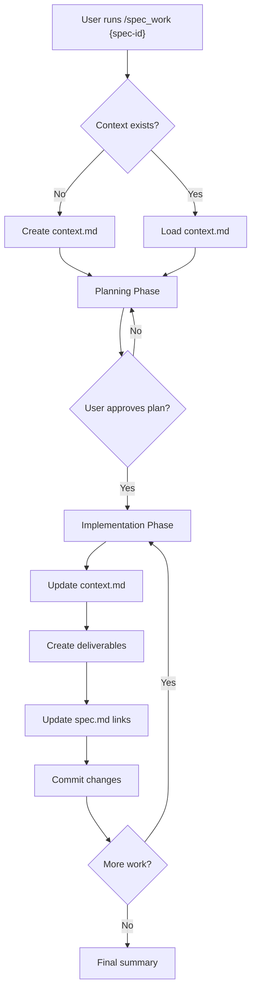

# Spec Workflow System Design

## Overview

This document defines a comprehensive workflow system for managing specifications, tracking implementation progress, and maintaining traceability between specs, context files, and deliverables.

## Core Components

### 1. Specification Files (`.spec.md`)
- **Purpose**: Define what needs to be built
- **Location**: `specs/{id}-{type}-{name}/` 
- **Format**: Structured markdown with metadata headers

### 2. Context Files (`.context.md`)
- **Purpose**: Track HOW things were built
- **Location**: `specs/{id}-{type}-{name}/{id}.context.md`
- **Format**: Timeline-based implementation journal
- **Lifecycle**: Created when spec implementation begins, updated throughout

### 3. Deliverables Registry
- **Purpose**: Track all outputs from spec implementation
- **Location**: Within context file's "Deliverables" section
- **Format**: Categorized list with bidirectional links

## Improved Folder Structure

### Current Issues
- Redundant naming: `1001-feature-storage/1001-feature-storage.spec.md`
- Long paths for sub-specs
- Difficult to distinguish spec types

### Proposed Structure
```
specs/
├── 1000/                          # Epic ID (short)
│   ├── epic.md                   # Main epic spec
│   ├── context.md                 # Epic context file
│   ├── 1001/                     # Feature ID
│   │   ├── spec.md               # Feature spec
│   │   ├── context.md            # Feature context
│   │   ├── 1011.spec.md          # Task spec (inline)
│   │   ├── 1011.context.md       # Task context
│   │   └── deliverables/         # Feature deliverables
│   │       ├── scripts/
│   │       └── docs/
│   └── 1002/                     # Another feature
│       ├── spec.md
│       └── context.md
```

### Benefits
- Shorter paths (no redundant naming)
- Clear hierarchy (epic → feature → task)
- Deliverables co-located with specs
- Consistent file naming (`spec.md`, `context.md`)

## Bidirectional Linking System

### Obsidian-Compatible Links
All links use standard markdown format with relative paths:

```markdown
# In spec file
[[context|Implementation Context]]
[[deliverables/scripts/setup.sh|Setup Script]]

# In context file  
[[spec|Original Specification]]
[[../../1000/epic|Parent Epic]]

# In deliverable files
<!-- Spec: [[../../spec|Storage Infrastructure Spec]] -->
<!-- Context: [[../../context|Implementation Journal]] -->
```

### Link Types

#### 1. Spec ↔ Context Links
```markdown
# In spec.md header
**Context**: [[context|Implementation Journal]]

# In context.md header
**Specification**: [[spec|Original Spec]]
```

#### 2. Spec ↔ Deliverable Links
```markdown
# In spec.md deliverables section
## Deliverables
- [[deliverables/scripts/nas-setup.sh|NAS Setup Script]]
- [[deliverables/docs/storage-guide.md|Storage Configuration Guide]]

# In deliverable file header
<!-- Generated from: [[../../spec|Cold Storage Spec]] -->
```

#### 3. Parent ↔ Child Links
```markdown
# In epic spec
## Features
- [[1001/spec|Storage Infrastructure]]
- [[1002/spec|Development Environment]]

# In feature spec
**Parent**: [[../epic|Foundation Infrastructure Epic]]
```

## Context File Template

```markdown
# Context: {Spec Title}

**Spec**: [[spec|{Spec ID} - {Spec Title}]]  
**Parent**: [[../epic|{Parent Epic}]]  
**Status**: {planning|implementing|completed|blocked}  
**Created**: {YYYY-MM-DD HH:MM}  
**Updated**: {YYYY-MM-DD HH:MM}

## Summary
Brief description of what this spec implements and its current status.

## Implementation Timeline

### Session 1: {YYYY-MM-DD} - {Session Title}
**Duration**: {X hours}  
**Participants**: {User, Claude}  
**Status**: {completed|partial|blocked}

#### Planning
- Brainstormed approach for {topic}
- Decided to use {technology/pattern}
- Created initial task breakdown

#### Changes to Spec
- Added acceptance criteria for {feature}
- Updated technical approach section
- Modified dependencies

#### Implementation
- Created [[deliverables/scripts/setup.sh|Setup Script]]
- Modified `services/broker/api.ts` ([Line 45](file://services/broker/api.ts:45))
- Added configuration to `.env.example`

#### Testing
- Ran unit tests: ✅ All passing
- Integration test results: 
  - Connection test: ✅
  - Performance test: ⚠️ (needs optimization)

#### Commits
- `a1b2c3d`: Initial NAS configuration script
- `d4e5f6g`: Add network buffer optimizations
- `h7i8j9k`: Create directory structure

#### Issues & Resolutions
- **Issue**: Permission denied on /mnt/nas
- **Resolution**: Added user to nas-users group
- **Commit**: `l0m1n2o`

### Session 2: {YYYY-MM-DD} - {Session Title}
...

## Deliverables

### Scripts
- [[deliverables/scripts/nas-setup.sh|NAS Setup Script]] - Automated NAS mount configuration
- [[deliverables/scripts/health-check.sh|Health Check]] - Monitor NAS connectivity

### Documentation  
- [[deliverables/docs/storage-guide.md|Storage Configuration Guide]]
- [[deliverables/docs/troubleshooting.md|Troubleshooting Guide]]

### Configuration Files
- [[deliverables/config/fstab.example|Example fstab entries]]
- [[deliverables/config/sysctl.conf|Network optimization settings]]

### Code Changes
- `services/storage/nas-client.ts` - NAS client implementation
- `config/storage.config.ts` - Storage tier configuration
- `tests/storage/nas.test.ts` - Unit tests for NAS operations

## Dependencies Delivered To

### Downstream Specs
- [[../../3000/3001/spec|Market Data Collection]] - Uses cold storage for historical data
- [[../../9000/9001/spec|Backtesting Framework]] - Reads historical data from NAS

### Integration Points
- Storage Manager Service: `services/storage-manager/`
- Data Pipeline: `services/data-pipeline/` 
- Archive Service: `services/archive/`

## Metrics

### Implementation
- **Total Sessions**: 3
- **Total Duration**: 4.5 hours
- **Lines of Code**: +1,250, -85
- **Files Created**: 8
- **Files Modified**: 12

### Quality
- **Test Coverage**: 92%
- **Performance**: 1.0 GB/s write, 899 MB/s read
- **Acceptance Criteria Met**: 8/8 ✅

## Notes & Learnings

### Technical Decisions
- Chose NFS over SMB for better Linux compatibility
- Used 1MB buffer size for optimal throughput
- Implemented retry logic for network interruptions

### Future Improvements
- Consider implementing caching layer
- Add compression for archival data
- Create automated backup strategy

### References
- [NFS Performance Tuning](https://www.kernel.org/doc/html/latest/admin-guide/nfs/nfs-client.html)
- [Synology NAS Best Practices](internal-link)
```

## New Command: `/spec_work`

### Purpose
Manage the complete lifecycle of spec implementation with full traceability.

### Workflow



### Command Usage

```bash
# Start working on a spec
/spec_work 1014

# Resume work on a spec
/spec_work 1014 --resume

# View spec implementation status
/spec_work 1014 --status

# Generate deliverables report
/spec_work 1014 --deliverables
```

### Command Implementation

```typescript
interface SpecWorkOptions {
  specId: string;
  action?: 'start' | 'resume' | 'status' | 'deliverables';
  session?: string; // Optional session title
}

class SpecWorkCommand {
  async execute(options: SpecWorkOptions) {
    const spec = await this.loadSpec(options.specId);
    const context = await this.loadOrCreateContext(spec);
    
    switch(options.action) {
      case 'start':
      case 'resume':
        await this.startSession(spec, context, options.session);
        break;
      case 'status':
        await this.showStatus(spec, context);
        break;
      case 'deliverables':
        await this.showDeliverables(spec, context);
        break;
    }
  }

  private async startSession(spec: Spec, context: Context, title?: string) {
    // 1. Create new session in context
    const session = context.createSession(title || 'Implementation Session');
    
    // 2. Show current spec status
    this.displaySpecSummary(spec);
    
    // 3. Enter interactive implementation mode
    while (true) {
      const action = await this.promptAction();
      
      switch(action) {
        case 'plan':
          await this.recordPlanning(session);
          break;
        case 'implement':
          await this.recordImplementation(session);
          break;
        case 'test':
          await this.recordTesting(session);
          break;
        case 'deliver':
          await this.createDeliverable(session);
          break;
        case 'commit':
          await this.commitProgress(session);
          break;
        case 'done':
          await this.finalizeSession(session);
          return;
      }
      
      // Auto-save context after each action
      await context.save();
    }
  }

  private async createDeliverable(session: Session) {
    // 1. Determine deliverable type and location
    const type = await this.promptDeliverableType();
    const content = await this.generateDeliverable(type);
    
    // 2. Save to co-located deliverables folder
    const path = `${session.spec.path}/deliverables/${type}/${filename}`;
    await this.saveFile(path, content);
    
    // 3. Update context with deliverable link
    session.addDeliverable({
      type,
      path,
      description,
      link: `[[${relativePath}|${filename}]]`
    });
    
    // 4. Update spec with deliverable reference
    await this.updateSpecDeliverables(session.spec, path);
    
    // 5. Add traceback comment to deliverable
    await this.addTracebackComment(path, session.spec);
  }
}
```

## Benefits of This System

### 1. Complete Traceability
- Every action is logged with timestamp
- All deliverables linked to source specs
- Implementation history preserved

### 2. Mobile-Friendly Review
- Obsidian-compatible links work on mobile
- All related files are interconnected
- Easy navigation between specs and implementations

### 3. Organized Deliverables
- Co-located with specs (easy to find)
- Categorized by type
- Bidirectional links for navigation

### 4. Timeline-Based History
- Sessions capture work progression
- Changes to specs are tracked
- Issues and resolutions documented

### 5. Improved Collaboration
- Clear handoff between sessions
- Complete context for any developer
- Decisions and rationale preserved

## Migration Strategy

### Phase 1: Structure Migration
1. Create new folder structure
2. Move specs to new locations
3. Update all internal links

### Phase 2: Context Creation
1. Generate context files for completed specs
2. Extract deliverable information
3. Create bidirectional links

### Phase 3: Command Integration
1. Implement `/spec_work` command
2. Update existing commands to use new structure
3. Deprecate old `/run_task` command

## Summary

This workflow system provides:
- **Traceability**: Every implementation step is recorded
- **Organization**: Clear structure with co-located deliverables  
- **Navigation**: Bidirectional links between all artifacts
- **History**: Timeline-based implementation journal
- **Integration**: Works with existing tools (Git, Obsidian)